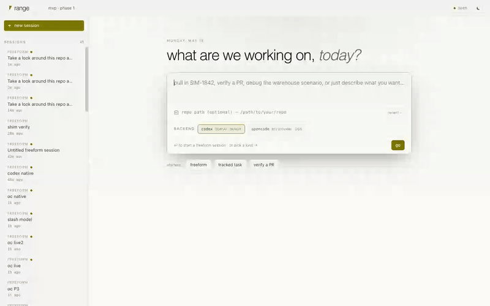

# Range

> An agentic IDE for engineers training robot policies in simulation.

You already have a sim. You already have an experiment tracker. You
already have a config framework. You already have an LLM coding
assistant. What you don't have is the thing that **understands all
four at once**, watches your training runs, and helps when they go
sideways.

That's Range.

---

## What it actually does

You attach a repo — yours, or one of the public ones like
[MuJoCo Playground](https://github.com/google-deepmind/mujoco_playground)
or [Isaac Lab](https://github.com/isaac-sim/IsaacLab). Range reads
its shape and gives you a chat-first workspace that knows about your
scenarios, your reward functions, your checkpoints, and the
canonical foot-guns of the libraries you're using.

A typical morning:

```text
┌─ you ──────────────────────────────────────────────────────────────┐
│ /scaffold                                                          │
└────────────────────────────────────────────────────────────────────┘

┌─ range ────────────────────────────────────────────────────────────┐
│ 📋 scaffold proposal · MuJoCo Playground                           │
│    • detected `pyproject.toml` with mujoco-mjx + brax              │
│    • 54 envs across locomotion / manipulation / dm_control         │
│    • 53 reward methods found across env files                      │
│    • picked 3 representative scenarios                             │
│    [ accept · write range.yaml ]  [ edit ]  [ dismiss ]            │
└────────────────────────────────────────────────────────────────────┘

┌─ you ──────────────────────────────────────────────────────────────┐
│ /g1_joystick_flat_terrain                                          │
└────────────────────────────────────────────────────────────────────┘

┌─ range ────────────────────────────────────────────────────────────┐
│ ▶ g1_joystick_flat_terrain · running · 47s                         │
│   reward 0.234 → 0.892   episodes 8,192   FPS 14.2k                │
│   ✗ failed — NaN at step 1,447                                     │
└────────────────────────────────────────────────────────────────────┘

┌─ you ──────────────────────────────────────────────────────────────┐
│ /investigate                                                       │
└────────────────────────────────────────────────────────────────────┘

┌─ range ────────────────────────────────────────────────────────────┐
│ Inspecting trajectory for run_mp9hguo9odj1ht…                      │
│ ▸ first NaN at tick 1,447 (t=7.235s)                               │
│ ▸ affected fields: ctrl[0], ctrl[1]                                │
│ ▸ last clean state showed min_depth approaching brake threshold    │
│                                                                    │
│ codex › reads pd_to_goal.py · finds the stale sentinel branch      │
│ codex › proposes a 4-line fix · diff card appears inline           │
└────────────────────────────────────────────────────────────────────┘
```

That whole loop is ~3 minutes. No leaving the chat. No grepping
through wandb. No digging through `events.jsonl` by hand.

---

## See it on any Python repo

Two real GitHub projects, dropped into Range cold — no `range.yaml`,
no Range-specific structure, no special prep. From `git clone` to a
working session in about thirty seconds:

<table>
<tr>
<td width="50%">

[**rl-baselines3-zoo**](https://github.com/DLR-RM/rl-baselines3-zoo) — the
canonical SB3 training framework. Range finds `train.py`, picks up
`hyperparams/`, and emits a starter scenario you edit to add `--algo`
and `--env`.



📹 Full quality: [`docs/media/sb3-zoo.mp4`](docs/media/sb3-zoo.mp4)

</td>
<td width="50%">

[**CleanRL**](https://github.com/vwxyzjn/cleanrl) — single-file RL
implementations. Range walks the package directory, finds 12
runnable algorithms (`ppo_atari`, `rainbow_atari`, `c51`, …),
detects `uv` from `pyproject`, and turns each into a scenario.


📹 Full quality: [`docs/media/cleanrl.mp4`](docs/media/cleanrl.mp4)

</td>
</tr>
</table>

> The same generic detector handles PureJaxRL, custom training repos,
> and even non-RL Python libraries (it scaffolds something sensible
> and gets out of your way). Framework-specific shortcuts kick in
> automatically when Range recognizes Playground or Isaac Lab.

---

## What's actually shipped

### 🪄 Auto-scaffold on attach

Drop in a repo with no `range.yaml`. Range detects the stack
(MuJoCo Playground, Isaac Lab, or generic Python — anything with a
`pyproject.toml`, `setup.py`, `requirements.txt`, or just `.py`
files) and proposes a complete profile: commands, scenarios, reward
function pointers, checkpoint patterns. For Playground, it also
auto-writes a `tools/range_shim.py` so sweep variables flow through
without code changes upstream. You accept, edit, or dismiss.
Five-second onboarding instead of an hour of YAML.

### 🩻 NaN / instability investigation

Trajectories silently corrupt. Reward goes to garbage. The bisect
across seeds takes a day. Range's `/investigate`:

- Walks `events.jsonl`, filters to trajectory ticks
- Finds the first NaN/Inf and the field that went bad
- Captures the last 5 clean ticks (the "what good looks like"
  anchor) + the first 5 contaminated ticks
- Hands Codex a structured report with investigation directives

Codex finishes the investigation. We've reproducibly hit
&lt;5 turns to root-cause + fix proposal on planted-bug fixtures in
the Playground fork (see [`docs/playground_fixtures.md`](docs/playground_fixtures.md)).

### 🪛 `/wire wandb-hydra` — patch the canonical foot-guns

Three bugs every Hydra + W&B user has tripped over:

1. `wandb.init()` hangs without `settings=wandb.Settings(start_method="thread")`
2. Passing a `DictConfig` to `wandb.config` breaks serialization
3. `wandb.config.update(cfg)` has the same bug

`/wire wandb-hydra` scans the repo (skipping `.venv`/comments/docstrings),
generates per-file patches with each transform explained, and lands
them through an inline approval card. The patched code passes
`python -m py_compile`.

### 📊 Checkpoints + reward functions as first-class entities

`range.yaml` declares your reward methods and checkpoint patterns.
Then:

- `/reward show g1_joystick_flat_terrain__tracking_lin_vel` — pulls
  the actual function source inline, syntax-highlighted, no leaving
  the chat
- `/eval /path/to/policy.pkl cartpole_balance` — re-runs the
  scenario with `RANGE_CHECKPOINT` env injected so your training
  script loads weights instead of training from scratch

### 📈 Live plans + trajectory scrubber

Codex's plan renders as a checklist pinned to the top of each
turn — `pending` items fade, `in_progress` pulses, `completed`
strike through, all in real time as the agent works. When a run
writes a `trajectory.npz`, an inline SVG viewer pops up: one panel
per field, a shared cursor synced across them, NaN gaps shown as
breaks. `/obs <run-id> <step>` dumps the full observation vector
at any tick.

### 🧠 Codex-native chat

The agent isn't bolted on — it *is* the workspace. Slash commands
let you swap models, sandbox levels, reasoning effort, and approval
modes mid-session. Conversations resume across idle-shutdown via
`thread/resume`. PRs draft + open inline with `/pr`.

### 🔀 Pick your agent backend

Two backends ship with v0.6:

- **Codex** — OpenAI's official CLI. Fast setup, OpenAI models.
- **OpenCode** — open-source, MIT, talks to any LLM provider
  (Anthropic, Google, Ollama for local models, OpenAI, more).

Choose at session create. Same Range surface either way: every
scaffold, scenario, slash builtin, and investigation flow works
on both. Codex-specific reasoning/effort knobs hide gracefully on
OpenCode sessions.

### ⚡ Built for the laptop

- Lazy-start: Codex only spawns when you actually need it
- 20-min idle-shutdown: no orphaned agent processes
- 16ms server-side delta coalescing: 5–10× fewer WebSocket frames
  per turn
- Memoized React timeline: long sessions stay snappy

---

## Who this is for

| You | Range fits |
|---|---|
| ML engineer training quadruped / humanoid locomotion in MuJoCo Playground | ✅ Primary audience |
| RL researcher iterating on reward shaping for manipulation | ✅ |
| Isaac Lab user on a Linux GPU box | ✅ (detection now, remote-exec landing v0.7) |
| Solo founder hacking on a JAX RL prototype | ✅ |
| Pure web/app developer | ❌ — this isn't Cursor |
| Building a brand-new simulator | ❌ — Range sits *on top of* a sim, it isn't one |

---

## Try it

> 💻 macOS, 10 minutes, no GPU required.

```bash
# 1. Prereqs (skip if you have them)
brew install bun uv git
npm install -g @openai/codex && codex login

# 2. Clone + install
git clone git@github.com:rangeai/range.git ~/personal/range
cd ~/personal/range/web && bun install

# 3. Optional: clone MuJoCo Playground for a real RL substrate
git clone https://github.com/google-deepmind/mujoco_playground.git ~/personal/mujoco_playground

# 4. Run
bun run dev
open http://localhost:5173/
```

In the UI: **new session → attach `~/personal/mujoco_playground` →
accept the scaffold proposal → run `/install` then
`/cartpole_balance`.** First run end-to-end inside a few minutes
(the first `/install` pulls the venv).

Full walkthrough: [`docs/user_guide.md`](docs/user_guide.md).
Full install reference: [`docs/dev_setup.md`](docs/dev_setup.md).

---

## Why now

Range is built against a specific bet: **70% of the daily pain in
sim-RL workflows is debugging, observability, and tool-stitching
— not algorithms or physics.** We confirmed it against the public
record:

- Isaac Lab onboarding is "30–60 minutes of YAML before you get
  value" (Toward Humanoids, 2025)
- Open issue `isaac-sim/IsaacLab#4047`: checkpoint resume is
  silently broken
- `wandb/wandb#4686`: Hydra+W&B sweep configs don't compose
- Isaac Lab Known Issues lists NaN-on-observation as a routine
  occurrence
- HN #47102305: "robotics DevOps is failing to scale" — every
  team's pipeline is a hand-rolled island

Range targets those workflows directly. The v0.5 product spec
([read it here](docs/range_product_spec_v0_5_sim_engineer_workflow.md))
walks through the audience research, the cited pain points, the
prioritized roadmap, and the things we explicitly *aren't* building
yet (3D scene viewer, hyperparameter search, remote compute — all
deferred behind specific customer signals).

---

## Roadmap

**v0.5 is complete. v0.6 (multi-backend) just landed.**

| Phase | What | Status |
|---|---|---|
| **P1** | Auto-scaffold `range.yaml` on attach | ✅ shipped |
| **P2** | NaN / instability investigation flow | ✅ shipped |
| **P3** | `/wire wandb-hydra` integration helper | ✅ shipped |
| **P4** | Checkpoints + reward functions as primitives | ✅ shipped |
| **P5** | Live plan tracking + interactive trajectory scrubber | ✅ shipped |
| **v0.6** | OpenCode backend — any LLM provider (Anthropic, Google, Ollama, …) | ✅ shipped |
| **v0.7** | Remote compute (Linux + RTX) for Isaac Lab users — the monetization gate | 📋 planned |

---

## Built on

- [Bun](https://bun.sh) — the runtime (server + tooling + native SQLite)
- [Hono](https://hono.dev) — the HTTP + WebSocket layer
- [React 19](https://react.dev) — the frontend
- [Zustand](https://zustand-demo.pmnd.rs/) — state management
- [Codex CLI](https://github.com/openai/codex) — the agent backend
- [MuJoCo](https://mujoco.org) — the sim everything dogfoods against

---

## Proof harness — Playground fork

Range's depth claims (`/investigate` finds bugs faster than raw
Codex, `/wire` patches the canonical foot-guns, etc.) are measured
against a **narrowly-diverged fork of MuJoCo Playground**:
[`rangeai/mujoco_playground`](https://github.com/rangeai/mujoco_playground).

The fork's `main` tracks upstream; each planted-bug fixture lives
on its own `range-fixture-*` branch so we can rebase cleanly against
new Playground releases. Comparison runs (Range vs. raw Codex) on
those fixtures drive the benchmark numbers in
[`docs/playground_fixtures.md`](docs/playground_fixtures.md).

---

## License

MIT — see [`LICENSE`](LICENSE).

---

<sub>v0.5 · Built for engineers who would rather debug a NaN than write another YAML file.</sub>
